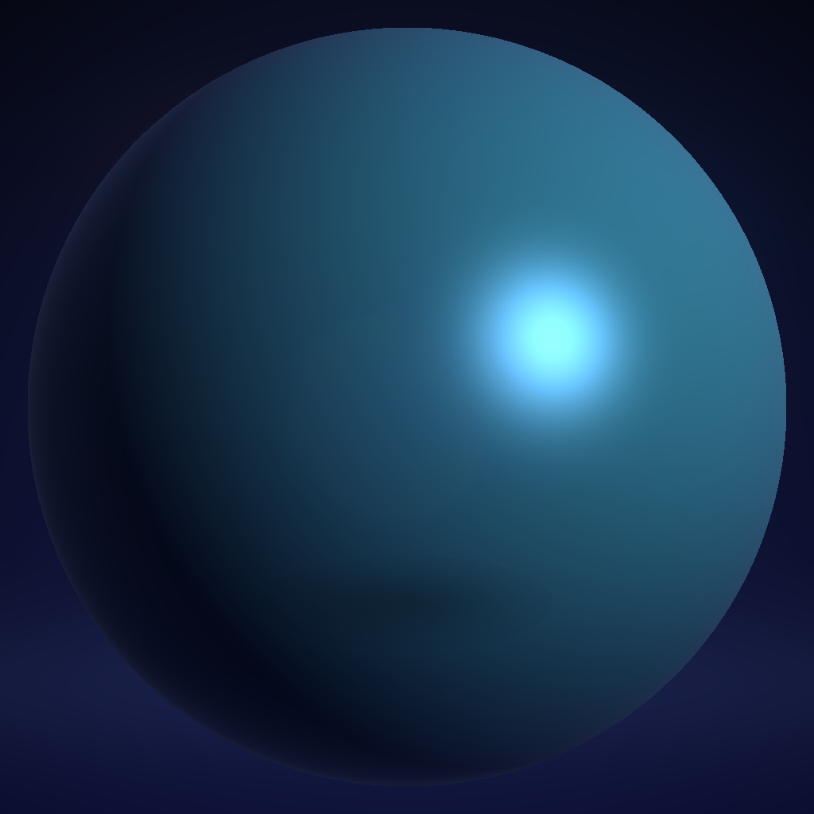

# RTDL

RTDL is a Python-hosted language/runtime for non-graphical workloads that can
be expressed as ray-tracing-style search: build an acceleration structure,
traverse it, refine candidate hits, and emit stable rows for an application.

It gives you:

- built-in workload primitives for released workload families
- a Python-hosted DSL for writing kernels
- multiple execution backends behind one public surface
- a clean model where RTDL owns traversal/refinement and Python owns app logic

The current released surface now spans geometric, nearest-neighbor, graph, and
bounded database-style analytical workloads, but the language goal is broader
than any one workload family alone.

The current released version is `v0.9.6`. The release includes the existing
HIPRT line, exact bounded closest-hit support, Apple RT consolidation on macOS
Apple Silicon, the bounded any-hit / visibility-row / emitted-row reduction
slice, and prepared/prepacked repeated 2D visibility/count optimizations.

`v0.9.5` added bounded any-hit / early-exit traversal as
`rt.ray_triangle_any_hit(exact=False)`, line-of-sight helpers
(`rt.visibility_rows_cpu(...)` / `rt.visibility_rows(...)`), and
`rt.reduce_rows(...)` for deterministic Python-side reductions over emitted
rows. The released `v0.9.5` tag has native any-hit paths for OptiX, Embree, and
HIPRT. `v0.9.6` releases the post-`v0.9.5` current-main backend expansion:
Vulkan native early-exit any-hit after rebuilding `librtdl_vulkan`, Apple MPS RT
3D any-hit based on nearest-intersection existence, Apple RT 2D MPS-prism
native-assisted any-hit after rebuilding `librtdl_apple_rt`, and prepared
repeated-query 2D any-hit / visibility-count paths for Apple RT, OptiX, HIPRT,
and Vulkan. The fastest measured paths reuse build-side acceleration structures
and prepack probe-side rays before returning a scalar or compact yes/no result.
These are bounded visibility/count optimizations, not broad speedup claims for
DB, graph, one-shot calls, or full emitted-row workloads. `reduce_rows` is a
standard-library helper, not a native RT backend reduction.

RTDL is not a general-purpose renderer or graphics engine.
The visual demo in this repository exists as a proof that the same RTDL compute
core can power a bounded Python application.

## Why RTDL Is Useful

Modern ray-tracing workloads usually require the same hard plumbing before the
real idea appears: shape data into backend buffers, build acceleration
structures, launch backend-specific kernels, refine candidate hits, normalize
result rows, and keep CPU/GPU/RT-backend variants consistent.

RTDL's authoring target is a **10x reduction in workload-writing burden**. That
is an engineering-productivity target, not an unbounded speedup claim: you write
one compact kernel shape, keep application logic in Python, and let RTDL own the
accelerated traversal/refinement path across the supported backends.

The recurring mental model is:

1. declare `probe` and `build` inputs
2. run `traverse(..., accel="bvh")`
3. run `refine(...)` for exact workload semantics
4. `emit(...)` stable application rows

That same shape now covers released geometry, nearest-neighbor, graph, and
bounded DB-style analytical workloads.

## Version Status At A Glance

- current released version: `v0.9.6`
- current mainline state: released `v0.9.6` bounded any-hit, visibility-row,
  and emitted-row reduction work on top of the released v0.7 DB, v0.8 app,
  v0.9 HIPRT/closest-hit, v0.9.4 Apple RT consolidation, and
  prepared/prepacked repeated visibility/count optimization lines
- released `v0.9.6` surface:
  - `ray_triangle_any_hit` emits `{ray_id, any_hit}` rows and allows early
    termination after the first accepted triangle hit
  - OptiX, Embree, HIPRT, and Vulkan have native early-exit any-hit
    implementations in the released tag after backend rebuild where required;
    Apple RT has MPS RT 3D any-hit and MPS-prism 2D native-assisted any-hit
    with per-ray early exit after rebuilding `librtdl_apple_rt`
  - `visibility_rows_cpu` emits `{observer_id, target_id, visible}` rows by
    turning observer-target pairs into finite any-hit rays
  - `reduce_rows` reduces emitted rows by `any`, `count`, `sum`, `min`, or
    `max` in Python; it improves app ergonomics but is not a native backend
    speedup claim
  - `v0.9.6` has a prepared/prepacked Apple RT 2D visibility-count helper
    for repeated Mac visibility/collision apps; the claim is limited to scalar
    blocked-ray counts, not full emitted-row output
  - `v0.9.6` also has prepared repeated-query 2D any-hit helpers for
    OptiX, HIPRT, and Vulkan; the strongest measured results require stable
    build-side triangles and prepacked probe-side rays
  - the current OptiX dense-hit micro-result is encouraging but bounded; there
    is no broad any-hit speedup claim yet
- current released graph surface today:
  - `bfs`
  - `triangle_count`
- current bounded `v0.7.0` DB release surface:
  - `conjunctive_scan`
  - `grouped_count`
  - `grouped_sum`
  - native prepared DB dataset reuse on Embree, OptiX, and Vulkan
  - app-level and kernel-form DB demos
  - release-readiness and staging-authorization evidence through Goal 492
- current released `v0.8.0` app-building surface:
  - Hausdorff distance app using `knn_rows(k=1)` plus `rt.reduce_rows(max)`
    - Linux performance evidence now covers Embree, OptiX, Vulkan, SciPy
      `cKDTree`, scikit-learn `NearestNeighbors`, and FAISS `IndexFlatL2`
  - ANN candidate search app using `knn_rows(k=1)` over a Python-selected
    approximate candidate set, with recall and distance-ratio reporting
  - outlier detection and DBSCAN clustering apps using
    `fixed_radius_neighbors` plus `rt.reduce_rows(count)` before Python
    density thresholding or cluster-expansion logic
    - Linux Goal524 evidence now characterizes CPU/oracle, Embree, OptiX, and
      Vulkan timing for these three Stage-1 proximity apps, with no
      external-baseline speedup claim because SciPy was not installed in that
      validation checkout
    - current `main` also has prepared OptiX fixed-radius summary modes for
      these two apps: `rt_count_threshold_prepared` for outlier density
      thresholds and `rt_core_flags_prepared` for DBSCAN core flags. These use
      prepared OptiX traversal and avoid neighbor-row materialization for the
      bounded summary, but they are not KNN, Hausdorff, ANN, Barnes-Hut, or
      full DBSCAN cluster-expansion claims and still require RTX-class
      performance validation
    - current `main` also has bounded Embree summary modes for selected app
      outputs: Hausdorff `--embree-result-mode directed_summary`, event
      hotspot `--embree-summary-mode count_summary`, and service coverage
      `--embree-summary-mode gap_summary`. These are app-specific compact
      outputs, not replacements for row modes when users need witness rows,
      clinic ids, distances, or load counts
  - robot collision screening app using `ray_triangle_any_hit` plus
    `rt.reduce_rows(any)` before Python pose/link witness reporting
    - earlier Linux Goal509 evidence covered the hit-count formulation on CPU,
      Embree, and pre-fix OptiX. Goal748 found and fixed a short-ray OptiX
      correctness bug in that evidence line, so current OptiX robot claims must
      use the post-fix Goal748 parity/performance report instead of the old
      Goal509 OptiX numbers. Vulkan and Apple claims stay bounded until
      dedicated parity/performance gates exist
    - current `main` exposes `--output-mode pose_flags` and `--output-mode
      hit_count` so apps can avoid returning full witness rows when compact
      summaries are enough. OptiX `--optix-summary-mode prepared_count`
      returns a native scalar hit-edge count, and
      `--optix-summary-mode prepared_pose_flags` returns native pose-level
      collision flags without edge witnesses. RTX-class speedup claims still
      need RTX hardware validation
  - exact bounded RTXRMQ-style range-minimum query app using the new
    `ray_triangle_closest_hit` primitive plus Python result decoding
    - Linux Goal573 evidence covers CPU reference and Embree correctness and
      timing; OptiX, Vulkan, and HIPRT closest-hit kernels remain future native
      backend work
  - Barnes-Hut force approximation app using `fixed_radius_neighbors` plus
    Python quadtree/opening-rule/force reduction
    - Linux performance evidence now separates RTDL candidate-generation timing
      from Python force-reduction timing across CPU, Embree, OptiX, and Vulkan
  - tutorial and suite consolidation that records missing future language
    pressure instead of claiming new internals
- current released `v0.9.0` backend and primitive expansion:
  - HIPRT `run_hiprt` parity coverage for the accepted 18-workload Linux
    matrix across geometry, 2D geometry, nearest-neighbor, graph, and bounded
    DB-style analytics
  - prepared HIPRT reuse evidence for 3D ray/triangle hit-count, 3D
    fixed-radius nearest-neighbor, graph CSR, and bounded DB table data
  - exact bounded RTXRMQ-style RMQ through `ray_triangle_closest_hit` on CPU
    reference, `run_cpu`, and Embree
  - explicit non-claims: no AMD GPU validation, no HIPRT CPU fallback, no
    RT-core speedup claim from GTX 1070 evidence, and no OptiX/Vulkan/HIPRT
    closest-hit support yet
- current released `v0.9.1` Apple RT expansion:
  - `run_apple_rt` supports 3D `ray_triangle_closest_hit` on macOS Apple
    Silicon through Apple Metal/MPS
  - local Apple M4 Goal578 evidence covers build, context probe, direct helper
    parity, `run_apple_rt` parity, and empty-triangle behavior
  - explicit release non-claims: no full Apple backend parity, no Apple speedup
    claim, and no non-closest-hit Apple RT workload support in the `v0.9.1`
    tag
- current released `v0.9.4` Apple RT consolidation:
  - Goal582 made all 18 current RTDL predicates callable through
    `run_apple_rt` on Apple Silicon macOS, and Goals603-620 moved that surface
    to explicit native or native-assisted Apple execution modes
  - execution mode is explicit: MPS RT covers the supported geometry and
    nearest-neighbor slices, while Apple Metal compute covers the bounded DB
    and graph slices; some rows still use CPU exact refinement,
    aggregation, uniqueness, or ordering after native candidate/filter work
  - `run_apple_rt(..., native_only=True)` rejects unsupported shape/backend
    combinations instead of silently pretending they are Apple RT execution
  - Goal596 adds prepared Apple RT closest-hit reuse for repeated queries
  - Goal597 replaces the hit-count per-triangle loop with masked chunked
    nearest-hit traversal
  - Goal598 replaces the segment-intersection per-right-segment AS loop with
    masked chunked nearest-hit traversal and reports a stable local Apple M4
    dense-fixture median reduction from 0.092515083 s to 0.031314438 s, while
    still remaining about 4.17x slower than Embree on that fixture
  - backend maturity is documented separately: Embree is the only backend RTDL
    currently calls optimized/mature; Apple Metal/MPS RT is real and
    correctness-validated for bounded native/native-assisted slices with
    measured local improvements in the internal v0.9.2/v0.9.3 evidence lines,
    but not a broad speedup or mature-backend claim
- previous `v0.6.1` additions over `v0.5.0`:
  - the first released RTDL graph workload family
  - RTDL-kernel graph execution across CPU/oracle, Embree, OptiX, and Vulkan
  - PostgreSQL-backed graph correctness anchoring

For exact status:

- [RTDL Current Main Support Matrix](docs/current_main_support_matrix.md)
- [RTDL v0.9 Support Matrix](docs/release_reports/v0_9/support_matrix.md)
- [RTDL v0.9 Release Package](docs/release_reports/v0_9/README.md)
- [Backend Maturity](docs/backend_maturity.md)
- [Engine Feature Support Contract](docs/features/engine_support_matrix.md)
- [RTDL v0.9.1 Release Package](docs/release_reports/v0_9_1/README.md)
- [RTDL v0.9.6 Release Package](docs/release_reports/v0_9_6/README.md)
- [RTDL v0.9.6 Release Statement](docs/release_reports/v0_9_6/release_statement.md)
- [RTDL v0.9.6 Support Matrix](docs/release_reports/v0_9_6/support_matrix.md)
- [RTDL v0.9.6 Audit Report](docs/release_reports/v0_9_6/audit_report.md)
- [RTDL v0.9.5 Release Package](docs/release_reports/v0_9_5/README.md)
- [RTDL v0.9.5 Support Matrix](docs/release_reports/v0_9_5/support_matrix.md)
- [RTDL v0.9.4 Release Package](docs/release_reports/v0_9_4/README.md)
- [RTDL v0.9.4 Release Statement](docs/release_reports/v0_9_4/release_statement.md)
- [RTDL v0.9.4 Apple RT Support Matrix](docs/release_reports/v0_9_4/support_matrix.md)
- [RTDL v0.9.4 Audit Report](docs/release_reports/v0_9_4/audit_report.md)
- [RTDL v0.9.2 Internal Candidate Package](docs/release_reports/v0_9_2/README.md)
- [RTDL v0.8 Release Statement](docs/release_reports/v0_8/release_statement.md)
- [RTDL v0.8 Support Matrix](docs/release_reports/v0_8/support_matrix.md)
- [RTDL v0.6 Release Statement](docs/release_reports/v0_6/release_statement.md)
- [RTDL v0.6 Support Matrix](docs/release_reports/v0_6/support_matrix.md)
- [RTDL v0.7 Release Statement](docs/release_reports/v0_7/release_statement.md)
- [RTDL v0.7 Support Matrix](docs/release_reports/v0_7/support_matrix.md)
- [RTDL v0.5 Release Statement](docs/release_reports/v0_5/release_statement.md)
- [RTDL v0.5 Support Matrix](docs/release_reports/v0_5/support_matrix.md)
- [RTDL v0.4 Release Statement](docs/release_reports/v0_4/release_statement.md)
- [RTDL v0.4 Support Matrix](docs/release_reports/v0_4/support_matrix.md)

## Backend Names In Plain English

RTDL uses several backends behind one public kernel surface:

- `cpu_python_reference`:
  - the slowest but clearest Python truth path
- `CPU/oracle`:
  - RTDL's compiled C/C++ correctness baseline
  - this is what "oracle" means in this repo
- `Embree`:
  - the Intel CPU ray-tracing backend
  - current accelerated CPU backend
- `OptiX`:
  - the NVIDIA GPU ray-tracing backend
  - one of the main high-performance graph backends in `v0.6.1`
- `Vulkan`:
  - the Vulkan ray-tracing GPU backend
  - portable GPU path
  - one of the main high-performance graph backends in `v0.6.1`
- `HIPRT`:
  - released `v0.9.0` backend surface
  - `run_hiprt` covers the 18-workload HIPRT correctness/performance matrix
    on the Linux validation host
  - `prepare_hiprt` currently covers prepared 3D `ray_triangle_hit_count`,
    prepared 3D `fixed_radius_neighbors`, and prepared graph CSR reuse for
    `bfs_discover` / `triangle_match`, plus prepared bounded DB table reuse for
    `conjunctive_scan`, `grouped_count`, and `grouped_sum`
  - validated on the Linux NVIDIA CUDA path through HIPRT/Orochi; no AMD GPU
    validation, RT-core speedup, or CPU fallback is claimed
- `Apple RT`:
  - released `v0.9.1` closest-hit backend slice on macOS Apple Silicon
  - released `v0.9.4` exposes all 18 current predicates through
    `run_apple_rt` with explicit native or native-assisted modes
  - implemented through Apple Metal/MPS `MPSRayIntersector` for geometry and
    nearest-neighbor slices, plus Apple Metal compute kernels for bounded DB
    and graph slices
  - important hardware boundary: bounded DB and graph Apple paths are Apple GPU
    Metal-compute paths, not Apple MPS ray-tracing-hardware traversal paths
  - prepared closest-hit reuse and masked traversal reduce repeated setup
    overhead
  - released `v0.9.6` adds a prepared/prepacked 2D visibility-count path for
    repeated Apple Silicon visibility/collision apps
  - no broad hardware-speedup claim is made; local Apple M4 evidence is
    workload-dependent and Embree remains the mature performance baseline
- `PostGIS` / `PostgreSQL`:
  - not RTDL backends
  - used as external correctness/timing anchors for some workload families
  - for the `v0.7.0` DB release, PostgreSQL is the Linux correctness and
    repeated-query performance baseline

## OS Support At A Glance

Current honest platform story:

- `Linux`:
  - primary validation platform
  - current graph correctness/performance claims are made here
- `Windows`:
  - bounded support for the released graph/API/Embree surface
  - graph validation is part of the bounded support story
- `local macOS`:
  - bounded local support for portable Python/native paths
  - focused regression and local checks
  - bounded Apple RT checks on Apple Silicon after
    `make build-apple-rt`

If you want the exact current boundary instead of the short front-page summary,
use:

- [RTDL v0.8 Support Matrix](docs/release_reports/v0_8/support_matrix.md)
- [RTDL v0.6 Support Matrix](docs/release_reports/v0_6/support_matrix.md)
- [RTDL v0.7 Support Matrix](docs/release_reports/v0_7/support_matrix.md)

## See It Quickly

Primary front-door links:

- [Watch The Public 4K Demo Video](https://youtu.be/d3yJB7AmCLM)
- [Current Architecture](docs/current_architecture.md)
- [Capability Boundaries](docs/capability_boundaries.md)
- [Quick Tutorial](docs/quick_tutorial.md)
- [Tutorials](docs/tutorials/README.md)
- [Feature Quickstart Cookbook](docs/tutorials/feature_quickstart_cookbook.md)
- [v0.8 App Building](docs/tutorials/v0_8_app_building.md)
- [Release-Facing Examples](docs/release_facing_examples.md)
- [Hausdorff Linux Performance Evidence](docs/reports/goal507_hausdorff_linux_perf_report_2026-04-17.md)
- [Robot/Barnes-Hut Linux Performance Evidence](docs/reports/goal509_robot_barnes_linux_perf_report_2026-04-17.md)
- [RTDL v0.4 Application Examples](docs/v0_4_application_examples.md)
- [Documentation Index](docs/README.md)

Demo preview:

<p>
  <a href="https://www.youtube.com/watch?v=d3yJB7AmCLM">
    
  </a>
</p>

<p>
  <a href="https://www.youtube.com/watch?v=d3yJB7AmCLM"><strong>Open the RTDL 4K demo video on YouTube</strong></a>
</p>

## Start In Two Minutes

Clone and enter the repository:

```bash
git clone https://github.com/rubaolee/rtdl.git
cd rtdl
```

Create a local virtual environment and install the basic Python requirements:

```bash
python3 -m venv .venv
source .venv/bin/activate
python -m pip install --upgrade pip
python -m pip install -r requirements.txt
```

Windows `cmd.exe`:

```bat
py -3 -m venv .venv
.venv\Scripts\activate
python -m pip install --upgrade pip
python -m pip install -r requirements.txt
```

PowerShell:

```powershell
py -3 -m venv .venv
.venv\Scripts\Activate.ps1
python -m pip install --upgrade pip
python -m pip install -r requirements.txt
```

If `python3 -m venv` fails on Debian/Ubuntu because `ensurepip` is unavailable,
install the OS package first:

```bash
sudo apt install python3-venv
```

Run the smallest example:

```bash
PYTHONPATH=src:. python examples/rtdl_hello_world.py
```

Then run one released workload:

```bash
PYTHONPATH=src:. python examples/rtdl_segment_polygon_hitcount.py --backend cpu_python_reference --copies 16
```

Then run the feature cookbook when you want a compact recipe for every public
feature:

```bash
PYTHONPATH=src:. python examples/rtdl_feature_quickstart_cookbook.py
```

If you want the complete app inventory, including the spatial join examples,
read:

- [Application Catalog](docs/application_catalog.md)
- [App Engine Support Matrix](docs/app_engine_support_matrix.md)

Then try the released graph line:

```bash
PYTHONPATH=src:. python examples/rtdl_graph_analytics_app.py --backend cpu_python_reference
PYTHONPATH=src:. python examples/rtdl_graph_bfs.py --backend cpu_python_reference
PYTHONPATH=src:. python examples/rtdl_graph_triangle_count.py --backend cpu_python_reference
```

Then try the bounded `v0.7.0` DB release line:

```bash
PYTHONPATH=src:. python examples/rtdl_database_analytics_app.py --backend cpu_python_reference
PYTHONPATH=src:. python examples/rtdl_db_conjunctive_scan.py --backend cpu_python_reference
PYTHONPATH=src:. python examples/rtdl_db_grouped_count.py --backend cpu_python_reference
PYTHONPATH=src:. python examples/rtdl_db_grouped_sum.py --backend cpu_python_reference
```

Then try the released `v0.8.0` app-building line. These apps use existing RTDL
features and Python-owned application logic; they are not a new
backend/language contract beyond the documented support matrix:

```bash
PYTHONPATH=src:. python examples/rtdl_hausdorff_distance_app.py --backend cpu_python_reference
PYTHONPATH=src:. python examples/rtdl_ann_candidate_app.py --backend cpu_python_reference
PYTHONPATH=src:. python examples/rtdl_outlier_detection_app.py --backend cpu_python_reference
PYTHONPATH=src:. python examples/rtdl_dbscan_clustering_app.py --backend cpu_python_reference
PYTHONPATH=src:. python examples/rtdl_robot_collision_screening_app.py --backend cpu_python_reference
PYTHONPATH=src:. python examples/rtdl_barnes_hut_force_app.py --backend cpu_python_reference
```

Released `v0.9.0` HIPRT path for Linux hosts with the HIPRT SDK and
CUDA-compatible Orochi path installed:

```bash
make build-hiprt HIPRT_PREFIX=$HOME/vendor/hiprt-official/hiprtSdk-2.2.0e68f54
export RTDL_HIPRT_LIB=$PWD/build/librtdl_hiprt.so
export LD_LIBRARY_PATH=$HOME/vendor/hiprt-official/hiprtSdk-2.2.0e68f54/hiprt/linux64:${LD_LIBRARY_PATH:-}
PYTHONPATH=src:. python examples/rtdl_hiprt_ray_triangle_hitcount.py
```

That example shows the prepared 3D ray/triangle path. The broader `v0.9`
release status is tracked by the HIPRT matrix: `run_hiprt` has Linux parity
coverage for 18 workloads across geometry, 2D geometry, nearest neighbor,
graph, and bounded DB-style analytics.

Released Apple RT path on Apple Silicon macOS:

```bash
make build-apple-rt
PYTHONPATH=src:. python examples/rtdl_apple_rt_demo_app.py
```

That example compares CPU Python reference rows against `run_apple_rt` for 3D
closest-hit ray/triangle queries. The released `v0.9.4` line also includes
prepared closest-hit reuse through
`rt.prepare_apple_rt_ray_triangle_closest_hit(...)`.
The visibility-count example is released v0.9.6 app evidence for a prepared scene,
prepacked 2D rays, and scalar blocked-ray count. This remains bounded Apple RT
support, not a broad speedup claim.

In `v0.9.4`, `run_apple_rt` can execute the full current 18-predicate RTDL
surface on Apple Silicon macOS through explicit native/native-assisted
dispatch. Use `rt.apple_rt_support_matrix()` to see which predicates are
`native_mps_rt`, `native_mps_rt_2d_3d`, `native_metal_compute`, or
`native_metal_filter_cpu_aggregate`.

Goal583 added native Apple MPS RT execution for 3D `ray_triangle_hit_count`.
Goal597 then replaced the per-triangle loop with masked chunked nearest-hit
traversal. Goal590 added native 2D `segment_intersection`; Goal598 then
replaced the per-right-segment acceleration-structure loop with masked chunked
nearest-hit traversal plus analytic refinement. Goals617-620 added Apple Metal
compute/native-assisted coverage for `conjunctive_scan`, `grouped_count`,
`grouped_sum`, `bfs_discover`, and `triangle_match`.

Windows `cmd.exe`:

```bat
set PYTHONPATH=src;.
python examples\rtdl_hello_world.py
python examples\rtdl_segment_polygon_hitcount.py --backend cpu_python_reference --copies 16
python examples\rtdl_graph_bfs.py --backend cpu_python_reference
python examples\rtdl_graph_triangle_count.py --backend cpu_python_reference
python examples\rtdl_database_analytics_app.py --backend cpu_python_reference
python examples\rtdl_db_conjunctive_scan.py --backend cpu_python_reference
python examples\rtdl_db_grouped_count.py --backend cpu_python_reference
python examples\rtdl_db_grouped_sum.py --backend cpu_python_reference
python examples\rtdl_hausdorff_distance_app.py --backend cpu_python_reference
python examples\rtdl_ann_candidate_app.py --backend cpu_python_reference
python examples\rtdl_outlier_detection_app.py --backend cpu_python_reference
python examples\rtdl_dbscan_clustering_app.py --backend cpu_python_reference
python examples\rtdl_robot_collision_screening_app.py --backend cpu_python_reference
python examples\rtdl_barnes_hut_force_app.py --backend cpu_python_reference
```

PowerShell:

```powershell
$env:PYTHONPATH="src;."
python examples/rtdl_hello_world.py
python examples/rtdl_segment_polygon_hitcount.py --backend cpu_python_reference --copies 16
python examples/rtdl_graph_bfs.py --backend cpu_python_reference
python examples/rtdl_graph_triangle_count.py --backend cpu_python_reference
python examples/rtdl_database_analytics_app.py --backend cpu_python_reference
python examples/rtdl_db_conjunctive_scan.py --backend cpu_python_reference
python examples/rtdl_db_grouped_count.py --backend cpu_python_reference
python examples/rtdl_db_grouped_sum.py --backend cpu_python_reference
python examples/rtdl_hausdorff_distance_app.py --backend cpu_python_reference
python examples/rtdl_ann_candidate_app.py --backend cpu_python_reference
python examples/rtdl_outlier_detection_app.py --backend cpu_python_reference
python examples/rtdl_dbscan_clustering_app.py --backend cpu_python_reference
python examples/rtdl_robot_collision_screening_app.py --backend cpu_python_reference
python examples/rtdl_barnes_hut_force_app.py --backend cpu_python_reference
```

Notes:

- expected Python floor: `3.10+`
- local package name: `rtdsl`
- if your shell only provides `python3`, substitute `python3`
- `PYTHONPATH=src:.` is what makes the local `src/rtdsl/` package importable
- `cpu` auto-builds the native C oracle library on first use
- `embree` auto-builds/probes `build/librtdl_embree.*` on first use when the
  host has Embree headers/libraries available
- on Linux with a configured GPU stack, `optix` and `vulkan` can run after the backend libraries are available

Optional Embree backend build/probe step:

```bash
make build-embree
```

Optional Linux GPU backend build step:

```bash
make build-optix
make build-vulkan
```

Optional `v0.9.0` HIPRT backend build step on Linux:

```bash
make build-hiprt HIPRT_PREFIX=/path/to/hiprtSdk
```

After building, set `RTDL_HIPRT_LIB` to the built `librtdl_hiprt.so` and make
the HIPRT runtime library directory visible through `LD_LIBRARY_PATH` before
running HIPRT examples or the HIPRT matrix tests. This path is an active
`v0.9.0` release path with the platform limits documented in the v0.9 support
matrix.

Optional Apple RT build step on Apple Silicon macOS:

```bash
make build-apple-rt
```

After building, `examples/rtdl_apple_rt_demo_app.py` can exercise the current
public Apple RT app surface. The older `examples/rtdl_apple_rt_closest_hit.py`
and `examples/rtdl_apple_rt_visibility_count.py` files remain compatibility
helpers for focused tests, but the unified app is the public entry point.
Released v0.9.4 tests additionally cover prepared closest-hit, masked
hit-count, masked segment-intersection, expanded geometry and nearest-neighbor
slices, and Metal compute DB/graph paths.

For the current Apple RT dispatch and native-slice checks, run:

```bash
PYTHONPATH=src:. python -m unittest tests.goal582_apple_rt_full_surface_dispatch_test -v
PYTHONPATH=src:. python -m unittest tests.goal596_apple_rt_prepared_closest_hit_test tests.goal597_apple_rt_masked_hitcount_test tests.goal598_apple_rt_masked_segment_intersection_test -v
PYTHONPATH=src:. python -m unittest tests.goal617_apple_rt_db_conjunctive_scan_test tests.goal618_apple_rt_db_grouped_aggregation_test tests.goal619_apple_rt_graph_bfs_test tests.goal620_apple_rt_graph_triangle_match_test -v
```

Windows Embree note: install or unpack Embree for x64, set
`RTDL_EMBREE_PREFIX` to that Embree prefix, and set `RTDL_VCVARS64` if Visual
Studio Build Tools are not in the default location. A binary Windows snapshot
must either include the matching `build/librtdl_embree.dll` from this checkout
or allow first-use rebuild from source; stale DLLs are rejected when required
exports such as `rtdl_embree_run_fixed_radius_neighbors` are missing.

## Choose Your Path

If you are new:

1. [Quick Tutorial](docs/quick_tutorial.md)
2. [Tutorials](docs/tutorials/README.md)
3. [Feature Homes](docs/features/README.md)

If you want the released core workloads:

- [RTDL v0.2 User Guide](docs/v0_2_user_guide.md)
- [Release-Facing Examples](docs/release_facing_examples.md)

If you want the newest released graph line:

- [RTDL v0.6 Release Statement](docs/release_reports/v0_6/release_statement.md)
- [RTDL v0.6 Support Matrix](docs/release_reports/v0_6/support_matrix.md)

If you want the current bounded DB release line:

- [RTDL v0.7 Release Statement](docs/release_reports/v0_7/release_statement.md)
- [RTDL v0.7 Support Matrix](docs/release_reports/v0_7/support_matrix.md)

If you want the current released app-building line:

- [v0.8 App Building](docs/tutorials/v0_8_app_building.md)
- [Release-Facing Examples](docs/release_facing_examples.md)
- [RTDL v0.8 Release Package](docs/release_reports/v0_8/README.md)
- [RTDL v0.8 Support Matrix](docs/release_reports/v0_8/support_matrix.md)

If you want the earlier released nearest-neighbor line:

- [RTDL v0.4 Application Examples](docs/v0_4_application_examples.md)
- [RTDL v0.5 Release Statement](docs/release_reports/v0_5/release_statement.md)
- [RTDL v0.5 Support Matrix](docs/release_reports/v0_5/support_matrix.md)

If you want the application/demo side:

- [examples/visual_demo/rtdl_lit_ball_demo.py](examples/visual_demo/rtdl_lit_ball_demo.py)
- [examples/visual_demo/rtdl_hidden_star_stable_ball_demo.py](examples/visual_demo/rtdl_hidden_star_stable_ball_demo.py)
- [examples/visual_demo/render_hidden_star_chunked_video.py](examples/visual_demo/render_hidden_star_chunked_video.py)
- [Hidden-Star 4K Render Work Report](docs/reports/hidden_star_4k_render_work_report_2026-04-11.md)

## Current Release State

Current release:

- `v0.9.6`

Current mainline release line:

- bounded `v0.7.0` RT DB work, released `v0.8.0` app-building examples, and
  released `v0.9.0` HIPRT / closest-hit expansion, with released `v0.9.1`
  Apple RT closest-hit support
- released `v0.9.4` additionally carries Apple RT full-surface
  compatibility dispatch, expanded Apple MPS RT geometry/native-assisted slices,
  Apple Metal compute DB/graph slices, prepared closest-hit reuse, and masked
  Apple RT traversal optimizations inherited from the untagged `v0.9.2` and
  `v0.9.3` evidence lines
- released `v0.9.5` additionally carries bounded any-hit / visibility-row /
  emitted-row reduction support, with native early-exit any-hit for OptiX,
  Embree, and HIPRT
- released `v0.9.6` carries the prepared/prepacked repeated
  visibility/count optimization line: native Vulkan any-hit, Apple MPS RT 3D
  any-hit, Apple RT 2D MPS-prism any-hit after backend rebuild, and
  prepared/prepacked visibility/count paths for Apple RT, OptiX, HIPRT, and
  Vulkan under bounded scalar/compact-output contracts

Newest released graph workload surface:

- `bfs`
- `triangle_count`

Release and preview layers inside the current repository:

- `v0.2.0`: stable released segment/polygon and overlap workload family
- `v0.3.0`: released proof-of-capability demo/application layer on the same RTDL core
- `v0.4.0`: released nearest-neighbor workload expansion
- `v0.5.0`: released 3D nearest-neighbor and multi-backend expansion
- `v0.6.1`: released corrected RT graph line
- `v0.7.0`: released bounded DB line
  - current native prepared DB dataset work is validated on Linux across
    Embree, OptiX, Vulkan, and PostgreSQL for bounded synthetic repeated-query
    gates
  - current canonical performance wording is Goal 452: against the best
    PostgreSQL modes tested so far, query-only results are mixed, while
    setup-plus-10-query total time favors RTDL in the measured Linux evidence
  - release-readiness evidence is Goal 492: the package was held until explicit
    release authorization, with `rtdsl_current.tar.gz` as the only default
    staging exclusion
- `v0.8.0`: released app-building line on top of the released `v0.7.0` surface
  - apps added so far: Hausdorff distance, ANN candidate search, outlier
    detection, DBSCAN clustering, robot collision screening, and Barnes-Hut
    force approximation
  - Hausdorff now has bounded Linux Embree/OptiX/Vulkan performance evidence
    against SciPy, scikit-learn, and FAISS nearest-neighbor baselines
  - robot collision screening now uses v0.9.5 any-hit plus `reduce_rows`; the
    earlier bounded Linux CPU/Embree evidence applies to the hit-count
    formulation. The old Goal509 OptiX robot evidence is superseded by the
    post-fix Goal748 rerun after the short-ray OptiX bug fix, so new backend
    speedup claims need fresh gates
  - Barnes-Hut now has bounded Linux CPU/Embree/OptiX/Vulkan evidence with
    candidate generation separated from Python force reduction
  - Stage-1 proximity apps now have bounded Linux CPU/Embree/OptiX/Vulkan
    timing characterization through Goal524; that evidence is not a claim
    against SciPy, scikit-learn, FAISS, or production ANN/clustering systems
  - outlier and DBSCAN now have optional OptiX fixed-radius summary paths for
    threshold/core-flag output; public performance classification remains
    conservative until RTX-class evidence is available
  - selected Embree apps now have bounded compact summary modes:
    Hausdorff directed summary, event-hotspot count summary, and
    service-coverage gap summary. Each mode has its own report and boundary;
    the claim is app-output-specific, not a universal Embree speedup claim
  - the current claim is "RTDL rows plus Python app logic," not a new released
    backend/language surface
- `v0.9.0`: released HIPRT backend and closest-hit expansion
  - `run_hiprt` parity coverage for the accepted 18-workload Linux matrix
  - prepared HIPRT reuse evidence for selected repeated-query workload data
  - exact bounded RTXRMQ-style `ray_triangle_closest_hit` support on CPU
    reference, `run_cpu`, and Embree
  - no AMD GPU validation, HIPRT CPU fallback, RT-core speedup claim, or
    OptiX/Vulkan/HIPRT closest-hit support claim
- `v0.9.1`: released Apple RT closest-hit slice
  - `run_apple_rt` supports 3D `ray_triangle_closest_hit` through Apple
    Metal/MPS on macOS Apple Silicon
  - no full native Apple RT parity or speedup claim yet
- `v0.9.2`: untagged internal candidate evidence, absorbed into `v0.9.4`
  - Apple RT full-surface compatibility dispatch, prepared closest-hit reuse,
    and early Apple RT performance/overhead evidence
- `v0.9.3`: untagged internal native-coverage milestone, absorbed into `v0.9.4`
  - expanded Apple MPS RT geometry/native-assisted slices and associated
    correctness/performance evidence
- `v0.9.4`: Apple RT consolidation release
  - combines the untagged `v0.9.2`/`v0.9.3` Apple work with Apple Metal compute
    DB/graph slices, final release docs, full tests, and audit gates
  - Apple RT is not yet claimed as broadly faster than Embree
- `v0.9.5`: previous public release
- `v0.9.6`: current public release
  - adds `ray_triangle_any_hit`, `visibility_rows`, and `reduce_rows`
  - native early-exit any-hit exists for OptiX, Embree, HIPRT, and Vulkan when
    the backend library is rebuilt
  - Apple RT has 3D MPS RT any-hit plus 2D
    MPS-prism any-hit when `librtdl_apple_rt` is rebuilt from source
  - Apple RT also has a prepared/prepacked scalar visibility-count
    app path; do not generalize it to full emitted-row performance
  - `reduce_rows` is a Python helper over emitted rows, not native backend
    acceleration

Current public demo artifact:

- [RTDL 4K hidden-star demo video](https://youtu.be/d3yJB7AmCLM)

For exact backend/workload status, use:

- [RTDL v0.9 Support Matrix](docs/release_reports/v0_9/support_matrix.md)
- [RTDL v0.9.1 Release Package](docs/release_reports/v0_9_1/README.md)
- [RTDL v0.9.6 Release Package](docs/release_reports/v0_9_6/README.md)
- [RTDL Current Main Support Matrix](docs/current_main_support_matrix.md)
- [RTDL v0.9.6 Support Matrix](docs/release_reports/v0_9_6/support_matrix.md)
- [RTDL v0.9.5 Release Package](docs/release_reports/v0_9_5/README.md)
- [RTDL v0.9.5 Support Matrix](docs/release_reports/v0_9_5/support_matrix.md)
- [RTDL v0.9.4 Release Package](docs/release_reports/v0_9_4/README.md)
- [RTDL v0.9.4 Apple RT Support Matrix](docs/release_reports/v0_9_4/support_matrix.md)
- [RTDL v0.9.2 Internal Candidate Package](docs/release_reports/v0_9_2/README.md)
- [RTDL v0.8 Release Statement](docs/release_reports/v0_8/release_statement.md)
- [RTDL v0.8 Support Matrix](docs/release_reports/v0_8/support_matrix.md)
- [RTDL v0.6 Release Statement](docs/release_reports/v0_6/release_statement.md)
- [RTDL v0.6 Support Matrix](docs/release_reports/v0_6/support_matrix.md)
- [RTDL v0.7 Release Statement](docs/release_reports/v0_7/release_statement.md)
- [RTDL v0.7 Support Matrix](docs/release_reports/v0_7/support_matrix.md)
- [RTDL v0.5 Release Statement](docs/release_reports/v0_5/release_statement.md)
- [RTDL v0.5 Support Matrix](docs/release_reports/v0_5/support_matrix.md)

## What RTDL Contains

The repository currently includes:

- a Python-hosted DSL for authoring kernels
- compiler/lowering code
- released workload primitives
- native runtime layers for:
  - CPU/oracle: compiled C/C++ correctness baseline
  - Embree: Intel CPU ray-tracing backend
  - OptiX: NVIDIA GPU ray-tracing backend
  - Vulkan: Vulkan ray-tracing GPU backend
  - Apple RT: macOS Apple Silicon Metal/MPS backend slices for 3D closest-hit,
    hit-count, segment-intersection, point-neighborhood, point/polygon,
    segment/polygon, polygon-pair, and overlay work, plus Apple Metal compute
    DB/graph slices in released v0.9.4
- examples ranging from smallest first-run scripts to RTDL-plus-Python demos
- accepted v0.8 app-building examples that show RTDL rows inside Python apps

The public examples are organized as:

- top-level `examples/`: first-run and release-facing examples
- `examples/reference/`: readable reference kernels and fixture builders
- `examples/generated/`: generated bundles and preserved generated output
- `examples/visual_demo/`: RTDL-plus-Python application demos
- `examples/internal/`: preserved internal and historical artifacts

## What The Video Shows

The visual demo shows the correct RTDL application boundary:

- RTDL handles the accelerated compute/query core
- Python handles scene setup, animation, shading, and output

That is why the demo belongs here. It is not a product pivot toward graphics.
It is a proof that RTDL can act as the query engine inside a larger Python
application.

## Research Context

Ray-tracing hardware and software are very good at hierarchical traversal,
intersection, and search-style computation. RTDL uses that machinery for
accelerated workloads beyond image rendering alone, with the current released
surface strongest on geometric and nearest-neighbor work.

The motivating research target in this repository is:

- Liang Geng, Rubao Lee, and Xiaodong Zhang,
  *RayJoin: Fast and Precise Spatial Join*,
  Proceedings of the 38th ACM International Conference on Supercomputing
  (ICS 2024),
  DOI: [10.1145/3650200.3656610](https://dl.acm.org/doi/10.1145/3650200.3656610)

RTDL asks the next question: can these accelerated workloads be expressed
through a programmable language/runtime surface while staying correct across
multiple backends?

For broader context:

- [Workloads And Research Foundations](docs/workloads_and_research_foundations.md)
- [Future Ray-Tracing Directions](docs/future_ray_tracing_directions.md)

## Current Limits

Important honesty boundaries:

- the current released surface is strongest on geometric and nearest-neighbor workloads
- the current v0.9 line is released as `v0.9.6`, but it is still bounded by the
  documented Linux HIPRT, closest-hit, Apple RT, any-hit, visibility-row, and
  emitted-row reduction support matrices
- visual demos are bounded RTDL-plus-Python applications, not a renderer claim
- backend/platform availability is not identical on every machine
- Linux remains the primary validation platform
- PostGIS is an external indexed comparison baseline, not an RTDL backend
- PostgreSQL is the external baseline for the bounded `v0.7.0` DB release; RTDL is
  still not a DBMS and does not execute arbitrary SQL
- RTDL is not a DBMS
- `v0.7` DB performance claims are bounded to the tested Linux synthetic
  workloads; Goal 452 is the canonical comparison against best-tested
  PostgreSQL modes, not an exhaustive PostgreSQL tuning claim
- `v0.7.0` remains the bounded DB release; `v0.8.0` is the app-building
  release over that surface; `v0.9.0` adds HIPRT backend coverage and exact
  bounded closest-hit RMQ support under its support matrix; `v0.9.1` releases
  the bounded Apple RT closest-hit line; `v0.9.4` releases the Apple RT
  consolidation absorbing the internal v0.9.2/v0.9.3 work plus Apple Metal
  compute DB/graph coverage; `v0.9.5` releases bounded any-hit, visibility-row,
  and emitted-row reduction support; `v0.9.6` releases prepared/prepacked
  repeated visibility/count optimizations under scalar/compact-output
  contracts

For the precise current release boundary, use the release statement and support
matrix instead of inferring from the front page.

## Repository Layout

Key locations:

- `src/rtdsl/`: Python package and runtime surface
- `src/native/`: native backend implementations
  - root files such as `rtdl_optix.cpp`, `rtdl_hiprt.cpp`, and
    `rtdl_apple_rt.mm` are thin build wrappers
  - backend-specific implementation chunks live under directories such as
    `src/native/optix/`, `src/native/hiprt/`, and `src/native/apple_rt/`
- `examples/`: runnable examples
- `docs/`: tutorials, release reports, references, and history
- `tests/`: automated verification

Best next pages:

- [Documentation Index](docs/README.md)
- [Current Architecture](docs/current_architecture.md)
- [Quick Tutorial](docs/quick_tutorial.md)
- [Feature Homes](docs/features/README.md)
- [RTDL v0.8 Release Package](docs/release_reports/v0_8/README.md)
- [RTDL v0.7 Release Package](docs/release_reports/v0_7/README.md)
- [Complete History Map](history/COMPLETE_HISTORY.md)
